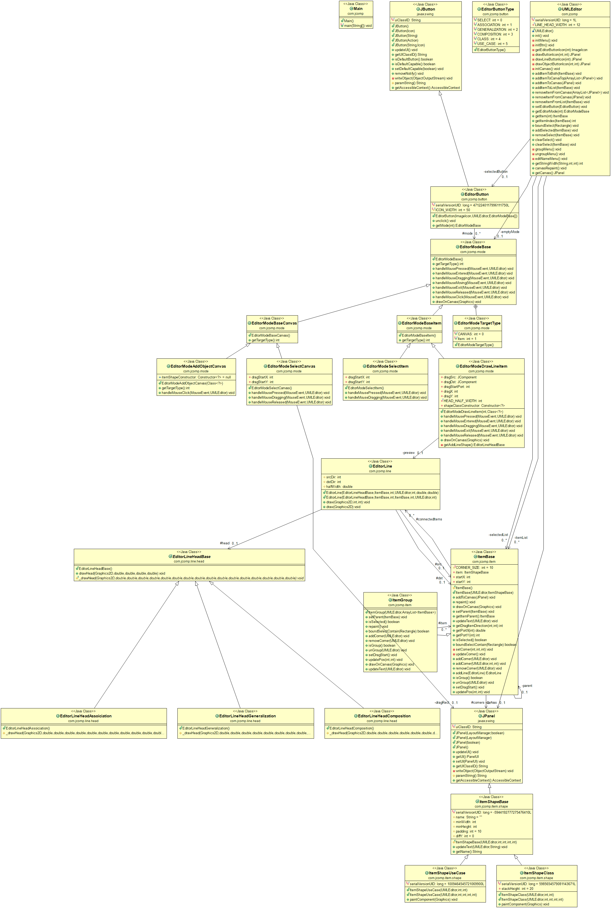
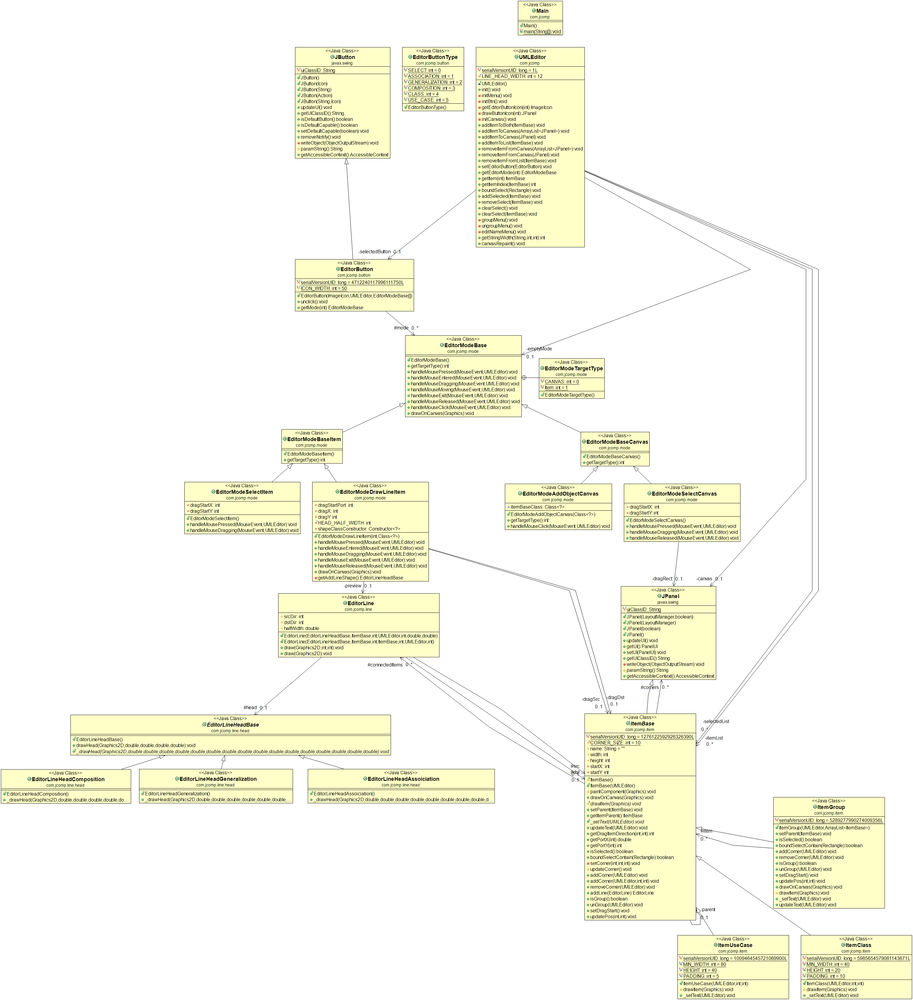
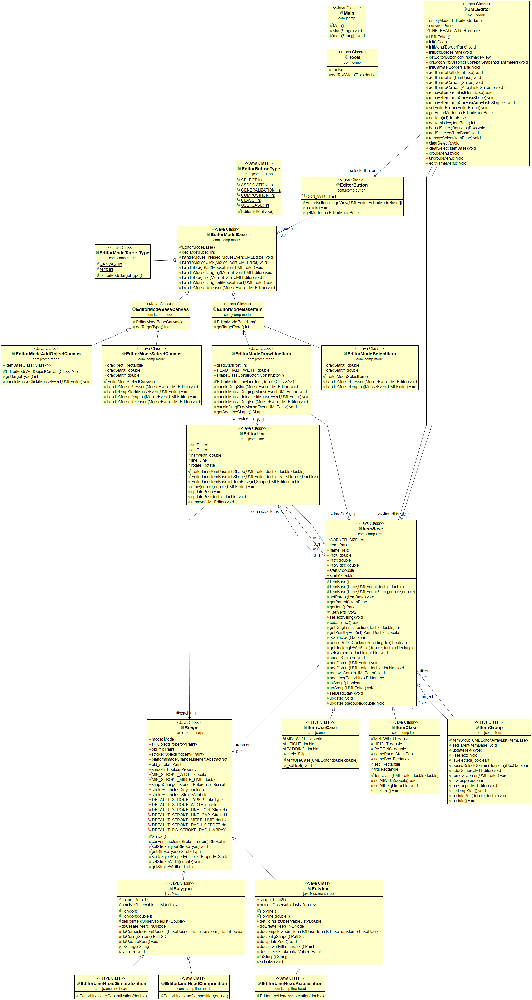
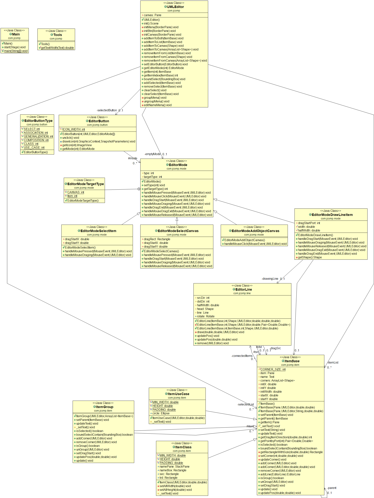

# XYZ UMLEditor
## Introduction
A simplified UML editor project in [2021-Spring-OOAD](https://classroom.google.com/u/0/c/Mjc3NjkxNTg3OTgw) for practicing object oriented programming

## How To Use
### Run
run by command Line
```
$ java -jar bin/uml-editor-4.0-Swing-jar-with-dependencies.jar
```
or 
```
# mvn exec:java -f "pom.xml"
```
Or directly run bin/uml-editor-4.0-Swing-jar-with-dependencies.jar
### Compile
```
# mvn compiler:compile -f "pom.xml"
```
or use IDE
### Pack To Jar
```
# mvn assembly:single -f "pom.xml"
```

## Environment
* Java SE Development Kit 16
* Apache Maven 3.6.3

## Spec
[UML editor requirement V1](UML%20editor%20requirement%20V1%20-%20use%20case%20format.pdf)

## UML strcuture
### V4.1

### V4.0

### V3.0

### V2.1



## ChangeLog
### V4.1
* Seperate Item JPanel from ItemBase
* Merge Item JPanel to Button Icon
### V4.0
Change Implementation to Swing Framework
### V3.0
Seperate Line Icon from create Line Mode
### V2.1
Seperate Mode for Canva and Item
### V2.0
Seperate Mode from Button
### V1.0
First version of all function